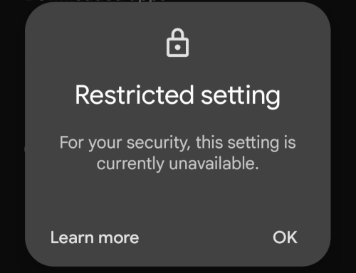
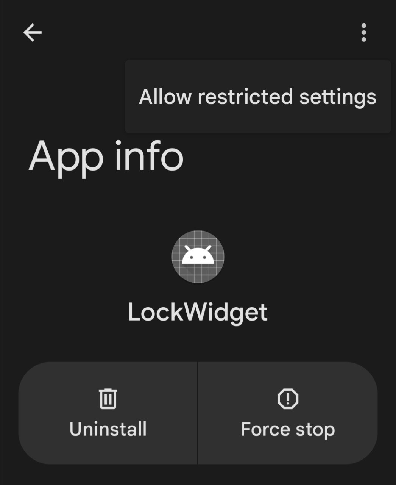

### What is it?
This is a simple application for android that provides double tap to lock on stock launcher
### Usage
- Build
- Add widget to homescreen
- Change boundaries of widget to desired size
- Double tap on widget and allow _accessibility_ permission 
- Now, you can simply double tap on home screen to lock your device
### Requirements
__Android 9.0+__
### Workaround for restricted setting (Android 13+)

If you encountered warning screen, like on the image above
follow this steps:

1. On your Android device, open the Settings app.
2. Tap Apps.
3. Tap the app that you want to turn on a restricted setting for.
4. Tap More and then Allow restricted settings.
5. Follow the on-screen instructions.

